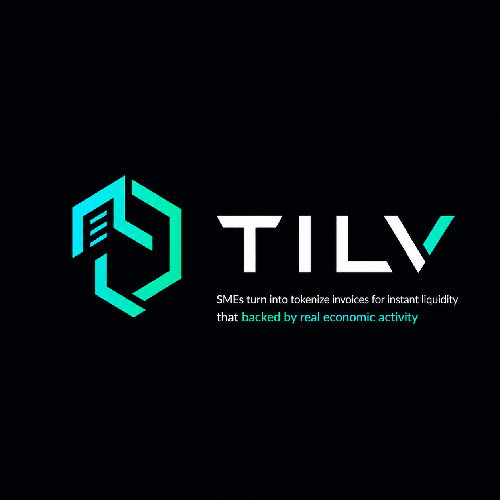

# TILV - Tokenized Invoice Liquidity Vault

<p align="center">
  
</p>

[](https://mantle.xyz)
[](https://opensource.org/licenses/MIT)

> **RealFi platform enabling SMEs to tokenize invoices for instant liquidity while investors earn stable yields backed by real economic activity.**

TILV transforms traditional invoice financing by leveraging blockchain technology, AI-powered risk assessment, and tokenization. SMEs can upload invoices, get AI validation, and receive liquidity in 24-48 hours. Investors provide liquidity through risk-tiered vaults and earn yields from invoice repayments.

## Live on Mantle Mainnet

| Contract | Address |
|----------|---------|
| InvoiceNFT | `0x0D85acea4D717f1bd9B28e4383a431B10e45Bc3e` |
| RiskEngine | `0x2B9B8E683C02355B531f5083696dea68637a53E9` |
| VaultManager | `0x2e7af7131e1CF8109D35209C128377BFD93Ab553` |
| AgentController | `0x7480Bce642B01B9078A9CB67E002f958De6E59bF` |
| USDT | `0x09Bc4E0D864854c6aFB6eB9A9cdF58aC190D0dF9` |

## Key Features

- **For SMEs**: Convert invoices to instant cash without traditional bank loans
- **For Investors**: Earn 4-25% APY from real-world cashflows
- **AI-Powered**: Automated OCR, validation, and risk scoring
- **On-Chain**: Transparent, immutable record on Mantle Network
- **Secure**: Multi-tier risk assessment and vault system

## Tech Stack

- **Blockchain**: Mantle Network, Solidity 0.8.20, Hardhat
- **Backend**: Node.js, Express, TypeScript, MongoDB, Redis
- **Frontend**: Next.js 14, React 18, Tailwind CSS, Wagmi, RainbowKit
- **AI/ML**: Python, FastAPI, Tesseract OCR
- **DevOps**: Docker, Docker Compose

## Project Structure

```
TILV---Mantle/
├── contracts/          # Solidity smart contracts (src/) + tests (test/)
│   ├── VaultManager.sol
│   ├── InvoiceNFT.sol
│   ├── RiskEngine.sol
│   ├── AgentController.sol
│   └── EmergencyPause.sol
├── backend/            # Node.js/Express API (src/)
├── frontend/           # Next.js app (app/, components/)
├── ai-engine/          # Python FastAPI + yield optimizer
├── docker/             # Docker Compose for all services
└── scripts/            # Setup automation
```

## Quick Start

### Prerequisites
- Node.js 18+, Python 3.9+, Docker
- MetaMask with Mantle network
- Tesseract OCR

### Run Locally

```bash
# Install all dependencies
npm run install:all

# Set up environment variables
cp backend/.env.example backend/.env
cp frontend/.env.example frontend/.env.local
# Fill in the values

# Start with Docker
npm run docker:up
```

### Access
- Frontend: http://localhost:3000
- Backend API: http://localhost:3001
- AI Engine: http://localhost:5000

## Smart Contracts

### VaultManager
Three-tier liquidity vault with deposit, withdraw, fund invoice, process repayment, and rebalance functions. Uses share-based pricing with proper accounting.

- **Prime**: Low risk (0-30 score), 80% advance rate
- **Growth**: Mid risk (31-60 score), 75% advance rate
- **Emerging**: High yield (61-100 score), 70% advance rate

### InvoiceNFT
ERC-721 token for invoice lifecycle: PENDING -> VALIDATED -> FUNDED -> PAID/DEFAULTED/CANCELLED. Uses OpenZeppelin v4.9 with AccessControl.

### RiskEngine
On-chain risk scoring with authorized oracles. Stores assessments, tracks tier averages, and enforces validity periods.

### AgentController
Manages the yield optimization agent via ERC-8004 interaction. Handles proposal submission, on-chain validation, and execution with cooldown and safety limits.

## Development

```bash
# Compile contracts
cd contracts && npx hardhat compile

# Run all tests
npm run test:all

# Test specific contract
cd contracts && npx hardhat test test/VaultManager.test.js

# Backend dev
cd backend && npm run dev

# Frontend dev
cd frontend && npm run dev
```

## Deployment

### Mainnet

```bash
cd contracts
npx hardhat run scripts/deploy.ts --network mantleMainnet
npx hardhat verify --network mantleMainnet <address>
```

### Testnet

```bash
cd contracts
npm run deploy:testnet
npm run verify:testnet
```

## Security

All critical functions are protected by:
- ReentrancyGuard
- AccessControl (role-based)
- Emergency pause/shutdown
- Slippage protection on withdrawals
- On-chain proposal hash verification
- Wallet signature verification on AI engine

## License

MIT
